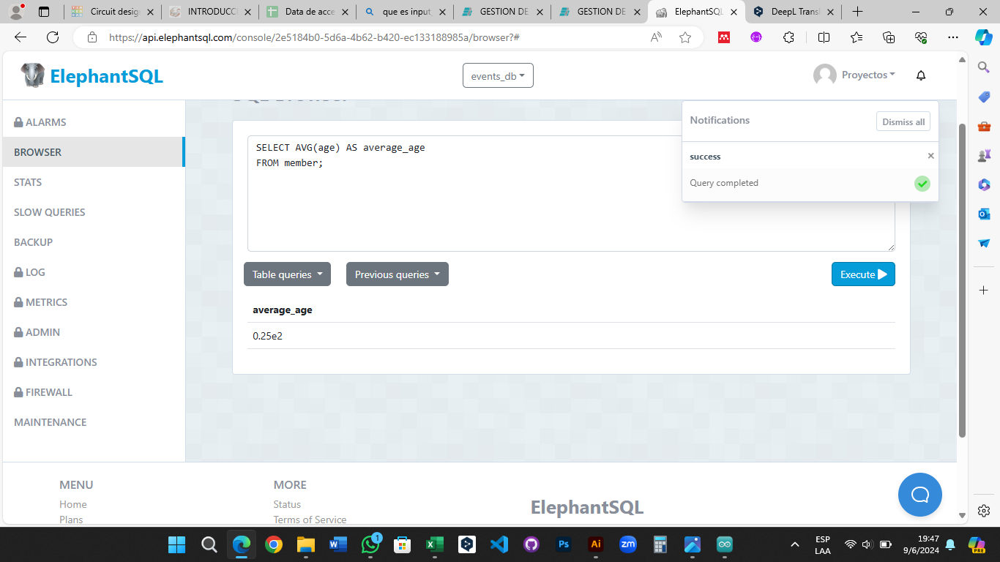

# TAS9 - Funciones agregación
## 1. Obtener la edad promedio de los miembros.
  - Sentencia:
  ```
  SELECT AVG(age) AS average_age
  FROM member;
  ```
  - Captura:



## 2. Obtener la edad mínima de los miembros.
  - Sentencia:
  ```
  SELECT MIN(age) AS min_age
  FROM member;
  ```
  - Captura:


## 3. Obtener el número total de registros asistidos.
  - Sentencia:
  ```
  SELECT COUNT(assisted) AS assisted_registrations
  FROM register
  WHERE assisted='true';
  ```
  - Captura:


## 4. Obtener el número total de asistentes a todas las conferencias.
  - Sentencia:
  ```
  SELECT SUM(total_attendees) AS total_number_attendees_all_conferences
  FROM conference;
  ```
  - Captura:


## 5. Obtener el número total de eventos por cada ciudad.
  - Sentencia:
  ```
  SELECT city, COUNT(city) AS total_events_by_city
  FROM event
  GROUP BY city;
  ```
  - Captura:


## 6. Obtener el número de registros por cada miembro.
  - Sentencia:
  ```
  SELECT member_id, COUNT(member_id) AS total_register_by_member
  FROM register
  GROUP BY member_id;
  ```
  - Captura:


## 7. Obtener el número de registros por cada conferencia.
  - Sentencia:
  ```
  SELECT conference_id, COUNT(conference_id) AS total_register_by_conference
  FROM register
  GROUP BY conference_id;
  ```
  - Captura:

